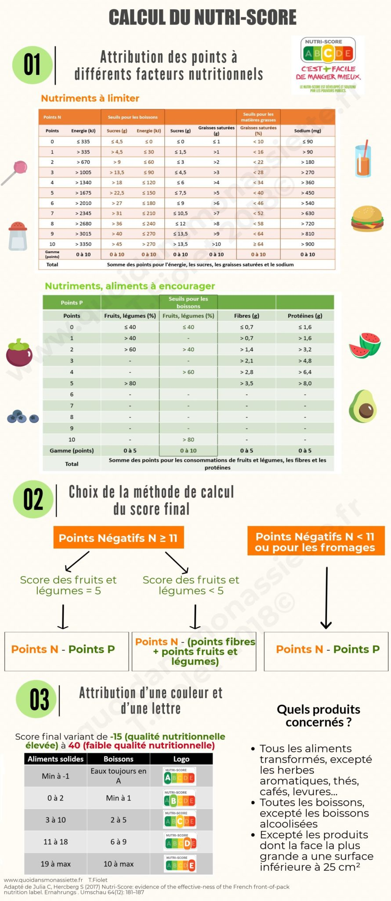

# Foodflix project

## Structure du projet 
<ul>
    <li>
        <a href="#">Data</a>
        <ul>
            <li><a href="#">intermediate_data</a></li>
            <li><a href="#">row_data</a></li>
        </ul>
    </li>
    <li>
        <a href="#">notebook</a>
        <ul>
            <li><a href="#">data_cleaning.ipynb</a></li>
            <li><a href="#">data_exploratory.ipynb</a></li>
        </ul>
    </li>
    <li>
        <a href="#">src</a>
        <ul>
            <li>
                <a href="#">data</a>
                <ul>
                    <li><a href="#">__init__.py</a></li>
                    <li><a href="#">data_import.py</a></li>
                </ul>
            </li>
            <li>
                <a href="#">utils</a>
                <ul>
                    <li><a href="#">__init__.py</a></li>
                    <li><a href="#">db_connect.py</a></li>
                    <li><a href="#">functions.py</a></li>
                </ul>
            </li>
            <li>
                <a href="#">__init.py__</a>
            </li>
        </ul>
    </li>
    <li>
        <a href="#">.gitignore</a>
    </li>
    <li>
        <a href="#">calcul_nutriscore.png</a>
    </li>
    <li>
        <a href="#">README.md</a>
    </li>
    <li>
        <a href="#">requirements.txt</a>
    </li>
</ul>  

## Contexte du projet

Vous intégrez FoodFlix, une startup de la FoodTech qui travaille actuellement sur une application permettant de recommander le meilleur produit à un utilisateur selon un mot clé ou un ensemble de mot clés. Les éléments à remonter sont les éléments liés au Nutri Score pour le MVP. Cependant vous pouvez être force de proposition et proposer de nouveaux éléments.

En tant que développeur IA, vous avez été missionné afin de prouver que la donnée récupérée va permettre de mettre en place cette future application.

Le travail consiste à étudier la donnée, selectionner le sous ensemble qui va permettre de mettre en place la solution et de proposer un jeu de données de bonne qualité permettant ainsi de passer à l'implementation du moteur de recommendation.

*Pour faciliter le travail, j'ai travaillé sur un sous ensemble du dataset.(Base de 10.000 observations).*

[Lien du dataset (Kaggle)](https://www.kaggle.com/openfoodfacts/world-food-facts)

### Objectifs

* Fournir une analyse du jeu de données permettant de faire un états des lieux
* Sélectionner la donnée sur laquelle l'application va se baser
* Adapter la bonne stratégie de nettoyage en cohérence avec l'amélioration de la qualité de la données afin de répondre au mieux aux besoins de l'utilisateur.

### Livrables

* Code de l'analyse de la donnée non nettoyée
* Code de selection des données et de nettayge de celle-ci
* Visualisation des données / Vérification de la consistance des données
* Slide de présentation du travail réalisé

**En complément :**  Utilisation du machine learning pour remplir les valeurs manquantes.

## Technologies utilisées

* Python (Notebooks)
* Pandas pour la manipulation de la donnée
* Sqlite3 pour le stockage des données nettoyées
* seaborn pour afficher, de façon graphique, l'analyse du jeu de données

## Liens et sources utilisés pour mon analyse

* [Information sur le nutriscore (mangerbouger)](https://www.mangerbouger.fr/Manger-mieux/Comment-manger-mieux/Comment-comprendre-les-informations-nutritionnelles/Qu-est-ce-que-le-Nutri-Score?xtor=SEC-33-GOO-[Nutriscore]--S-[nutri-score]&gclid=CjwKCAjw9MuCBhBUEiwAbDZ-7ggV6OrYm_YjqKBsRPhOppKS7D0wMRU37fMXhKimqjCY3r35VGkizRoCGI8QAvD_BwE&gclsrc=aw.ds)
* [Information sur le nutriscore (santé publique)](https://www.santepubliquefrance.fr/determinants-de-sante/nutrition-et-activite-physique/articles/nutri-score)

## Première étape

Dans un premier temps, il faut comprendre ce qu'on entend par nutriscore et se poser les questions suivantes. Qu'est-ce que le nutriscore, comment est -il attribué, quels sont les paramètres qui entrent en jeu de le calcul de celui-ci ? 
Cette étape est très importante pour notre analyse afin de garder seulement les données pertinantes. 

On peut commencer par remarquer que le nutriscore est calculé de façon de différente si le produit est transformé ou si il s'agit d'une boisson (Ne sont pas concerné les fruits, légumes frais, poissons ou encore les boissons alcolisées).

Le nutriscore est attribué sur la base d'un score prenant en compte pour 100g ou 100mL de produit, la teneur en :

* en nutriments et aliments à favoriser (fibres, protéines, fruits, légumes, légumineuses, fruits à coques, huile de colza, de noix et d'olive)

* en nutriments à limiter (énergie, acides gras saturés, sucres, sel)

## Deuxième étape

